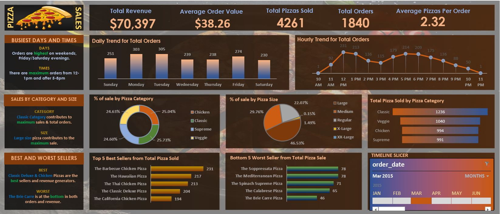

# 🍕 Pizza Sales Dashboard (Excel + SQL)

This project is an interactive sales dashboard built in Microsoft Excel using SQL query outputs. It provides insights into the performance of a pizza store, highlighting sales by category, best-selling items, order distribution by time, and key performance metrics.

---

## 📌 Project Overview

The pizza business generates a large volume of transaction data daily. This dashboard was developed to extract, analyze, and visualize that data using Excel, with SQL used for data preparation and aggregation.

---

## 📊 Key Metrics Tracked

- 📈 **Total Revenue**
- 🧾 **Total Orders**
- 🛒 **Average Order Value**
- 🍕 **Top 5 Pizzas by Revenue**
- 📦 **Orders by Category & Size**
- 🕐 **Sales Trend by Hour**

---

## 💡 Business Insights

- **Classic and Supreme categories** dominate overall revenue.
- **Large size pizzas** generate the most income.
- **12PM to 2PM** is the peak sales window (lunch hours).
- A small number of items account for a large proportion of revenue.

---

## 📸 Dashboard Preview

---

## 📁 Repository Structure

pizza-sales-dashboard/
├── Pizza Sales.xlsx
├── README.md
└── screenshots/
└── pizza-dashboard-preview.png

---

## 🛠 Tools Used

- Microsoft Excel (PivotTables, Charts, Slicers)
- SQL (for data querying)
- Excel Formulas for derived metrics

---

## 🚀 How to Use

1. Open the `Pizza Sales.xlsx` file in Excel.
2. Use slicers to filter data by category, size, or time.
3. Explore pivot charts for trends and top-selling items.

---

## 👩‍💻 Author

**Khushi Tripathi**  
🔗 [LinkedIn](https://www.linkedin.com/)  
🐱 [GitHub](https://github.com/KhushiTripathi21)

---

## 📄 License

This project is licensed under the [MIT License](LICENSE).

